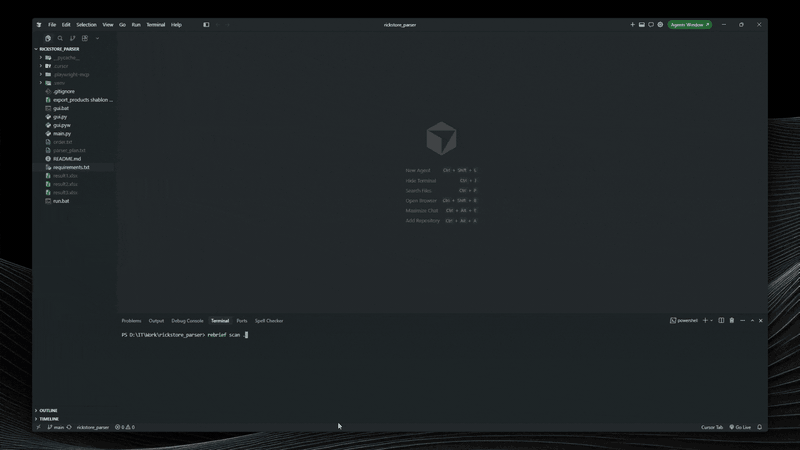

# rebrief

[](https://pypi.org/project/rebrief/)
[](LICENSE)

**Instantly turn any unfamiliar repository into a clean developer handoff dossier.**

A local CLI that scans any codebase and produces a structured `REBRIEF.md` report in ~30 seconds - stack, context, history, risks, and a where-to-start checklist.

## Navigation

- [Demo](#demo)
- [The Pain](#the-pain)
- [Before vs. After](#before-vs-after)
- [Key Features](#key-features)
  - [Stack detection](#stack-detection)
- [Installation & Quick Start](#installation--quick-start)
  - [Status badges](#status-badges)
  - [JSON output](#json-output)
  - [Excluding paths with `.rebriefignore`](#excluding-paths-with-rebriefignore)
  - [Remote repositories](#remote-repositories)
  - [MCP server](#mcp-server)
- [GitHub Actions](#github-actions)
  - [Set up in your repository](#set-up-in-your-repository)
  - [Use on a pull request](#use-on-a-pull-request)
- [Example Output](#example-output)
- [AI Prompting](#ai-prompting)
- [License](#license)

## Demo

```bash
rebrief scan .
```



Point it at any local repo or a remote Git URL. rebrief walks the stack, rules, git history, and risks, then writes `REBRIEF.md`.

---

## The Pain

You join a new project - after an outsourcing handoff, a freelancer exit, or years of legacy development. Your first week disappears into onboarding archaeology: manually mapping the tech stack, hunting buried TODOs, sorting through a noisy Git history, and trying to spot security and test gaps before you can ship anything. The knowledge is in the repo; nobody assembled it.

## Before vs. After


| Before                                        | After                                         |
| --------------------------------------------- | --------------------------------------------- |
| A week manually digging through code          | A 30-second local scan                        |
| Guessing project boundaries and setup context | Harvested context from rules files and README |
| Noisy git history hiding real decisions       | Filtered timeline + churn hotspots            |
| Unknown security and test gaps                | Prioritized risk map + developer checklist    |


```bash
rebrief scan .
# → REBRIEF.md
```

---

## Key Features

- **Deep Stack & Manifest Detection** - Recursive scan for ecosystem manifests across JavaScript/TypeScript, Python, Go, Rust, Java, Kotlin, PHP, and Ruby — including mono-repos and nested layouts. Parses dependencies, infers frameworks, and flags malformed manifests as warnings.
- **Context & Rules Harvesting** - Extracts local project context from `.cursorrules`, `CLAUDE.md`, `README.md`, and related instruction files so the next developer knows how the project was meant to be built.
- **Noise-Filtered Git Archaeology** - Filters low-value commits (wip, fix typo, minor updates) to surface a cleaner timeline of meaningful changes and 30-day change-density hotspots.
- **Local-First Risk Mapping** - Static analysis for hardcoded secrets, unresolved technical debt (TODO/FIXME), missing test directories, and dependency conflicts. Secret-like values under test/fixture paths are reported as WARNING (confirm they are fixtures) rather than CRITICAL credentials to rotate. No cloud upload, no API keys.
- **Token savings analysis** - Estimates raw codebase tokens vs the generated brief (`cl100k_base` via optional `tiktoken`, or a `len(text) / 4` fallback) and reports the compression ratio in the CLI, `REBRIEF.md`, and JSON `summary.token_stats`.
- **Markdown or JSON output** - Default handoff report is `REBRIEF.md`; use `-f json` for a structured `REBRIEF.json` payload (stack, timeline, risks, checklist) for scripts and tooling.

### Stack detection

rebrief walks the repo (up to three directory levels) and looks for common manifest files:

| Ecosystem | Manifests | Framework signals |
| --------- | --------- | ----------------- |
| JavaScript / TypeScript | `package.json` | React (`react`), Next.js (`next`, `next.config.js` / `.mjs`), Vue (`vue`), Angular (`@angular/core`, `angular.json`), Svelte (`svelte`, `svelte.config.js`), Express (`express`), NestJS (`@nestjs/core`), Remix (`@remix-run/node`, `remix.config.js`), Vite (`vite.config.js` / `.ts`), Nuxt.js (`nuxt.config.js` / `.ts`) |
| Python | `requirements.txt`, `pyproject.toml`, `poetry.lock` | Django (`django`, `manage.py`), Django REST Framework (`djangorestframework`), FastAPI (`fastapi`), Flask (`flask`) |
| Go | `go.mod` | Gin (`gin-gonic/gin`), Echo (`labstack/echo`), Fiber (`gofiber/fiber`) |
| Rust | `Cargo.toml` | Actix Web (`actix-web`), Axum (`axum`), Rocket (`rocket`) |
| Java | `pom.xml`, `build.gradle` | Spring Boot (`spring-boot`), Quarkus (`quarkus`), Micronaut (`micronaut`) |
| Kotlin | `build.gradle.kts` | Spring Boot (`spring-boot`), Quarkus (`quarkus`), Micronaut (`micronaut`) |
| PHP | `composer.json` | Laravel (`laravel/framework`, `artisan`), Symfony (`symfony/framework-bundle`), Slim (`slim/slim`) |
| Ruby | `Gemfile` | Rails (`rails`), Sinatra (`sinatra`) |

Each parser extracts direct dependencies from the manifest (for example `require` lines in `go.mod`, `[dependencies]` in `Cargo.toml`, or `require` in `composer.json`). Dependency-based framework detection uses exact matching for simple package names and substring matching for module coordinates (Go import paths, Maven/Gradle coordinates, Composer packages). Signature files such as `manage.py`, `artisan`, and `angular.json` are detected by filename alone.

If a manifest cannot be parsed, the scan continues and the report lists a **WARNING** for that file instead of failing the whole run.

---

## Installation & Quick Start

```bash
pip install rebrief
pip install "rebrief[tokens]"   # optional: accurate cl100k_base token counts
```

```bash
rebrief scan .
rebrief scan /path/to/repo -o REBRIEF.md
rebrief scan owner/repo             # GitHub shorthand → clone + scan
rebrief scan https://github.com/owner/repo
rebrief scan git@github.com:owner/repo.git
rebrief scan . -f json              # → REBRIEF.json
rebrief scan . -f json -o -         # JSON to stdout (status on stderr)
rebrief scan . --diff               # incremental vs HEAD~1
rebrief scan . --diff origin/main   # incremental vs PR/base ref
rebrief badge .                     # Shields.io Markdown + HTML to stdout
rebrief scan . --inject-badge       # update README.md badge markers
rebrief init .
rebrief mcp                         # MCP stdio server (requires rebrief[mcp])
rebrief mcp install                 # print IDE MCP config
```

Scan the current directory (default), any local path, or a remote Git repository (HTTPS, SSH, or GitHub `owner/repo` shorthand). Markdown output defaults to `REBRIEF.md`; JSON defaults to `REBRIEF.json`. Use `-o` to set a custom path, or `-o -` to write the report to stdout. Local scans write the report inside the target repo; remote scans write it in the directory where you ran the command.

Use `--diff [REF]` for an incremental scan of only files changed since a git ref (default `HEAD~1`). Stack, risk, and hotspot analysis run against that file list; structural checks such as a `tests/` directory remain repo-wide. Incremental Markdown reports are titled `REBRIEF INCREMENTAL REPORT`, and JSON includes `"mode": "incremental"`, `"diff_ref"`, plus `summary.files_scanned` / `summary.files_total`.

### Status badges

Generate a Shields.io badge from the current scan results:

```bash
rebrief badge .
```

Prints Markdown and HTML snippets to stdout. Colors reflect confidence-filtered risks: **brightgreen** (`clean`), **yellow** (`N risks` when only warnings/info), or **red** (`N critical`).

To keep a live badge in your README, add marker comments (or let `--inject-badge` create them):

```markdown
<!-- REBRIEF-BADGE:START -->
[](https://github.com/neracu/rebrief)
<!-- REBRIEF-BADGE:END -->
```

```bash
rebrief scan . --inject-badge
```

If the markers are present, the content between them is replaced. If they are missing, the badge block is inserted under the primary `# Header` in `README.md`.

### JSON output

For automation or downstream tools, pass `-f json` (or `--format json`). The report is a typed JSON object with `mode`, `diff_ref`, `summary`, `tech_stack`, `timeline`, `risk_map`, and `checklist` — the same analysis as the Markdown report, without section prose. The `summary` object includes `badge_url`, `badge_markdown`, file-count fields (`files_scanned`, `files_total`), and `token_stats` (`raw_codebase_tokens`, `brief_tokens`, `savings_percentage`, `tokenizer`) for full and incremental scans.

```bash
rebrief scan . -f json
rebrief scan . -f json -o report.json
rebrief scan . -f json -o - > REBRIEF.json
```

The `version` field matches the installed rebrief package version. GitHub Actions and `rebrief.ci.comment` still expect Markdown (`REBRIEF.md`); use JSON locally or in custom pipelines.

### Excluding paths with `.rebriefignore`

rebrief skips common noise by default (`node_modules`, `.git`, `dist`, `build`, `.next`, `.rebrief`, `__pycache__`, `.venv`, and similar). To exclude more paths, add a `.rebriefignore` file at the repo root using standard `.gitignore` syntax (globs, `#` comments, one pattern per line).

```bash
rebrief init .   # create a starter .rebriefignore
```

On the first `rebrief scan` of a local directory, rebrief creates `.rebriefignore` automatically if it is missing. Patterns in that file supplement the built-in defaults — they do not replace them.

### Remote repositories

`rebrief scan` accepts a Git URL or GitHub shorthand and shallow-clones into a temporary directory (`git clone --depth 100 --single-branch`), then deletes the clone when the scan finishes.

```bash
rebrief scan owner/repo
rebrief scan https://github.com/owner/repo
rebrief scan https://gitlab.com/group/repo
rebrief scan git@github.com:owner/repo.git
```

`owner/repo` resolves to `https://github.com/owner/repo`. If that path already exists as a local directory, rebrief scans the directory instead of cloning.

Private repositories use your local Git credentials (SSH keys, `gh` auth, credential helpers). You can also set `GITHUB_TOKEN` or `GIT_AUTH_TOKEN` for HTTPS clones. If the clone fails, rebrief exits with:

`Error: Unable to access remote repository. Check the URL or your Git authentication credentials.`

### MCP server

AI agents (Claude Code, Cursor, Windsurf, Roo Code) can query stack, risks, hotspots, and the full `REBRIEF.md` summary over [Model Context Protocol](https://modelcontextprotocol.io/) stdio.

```bash
pip install "rebrief[mcp]"
rebrief mcp            # start the stdio server
rebrief server         # alias for `rebrief mcp`
rebrief mcp install    # print client JSON (add --write to merge into config files)
```

If the extra is not installed, `rebrief mcp` exits with install instructions. Repeated tool calls in one agent session are served from an in-memory cache plus `.rebrief/cache.json` (file fingerprint), so unchanged local repos skip a rescan. Remote URL targets are cloned on demand and cached in memory for the server process (`force_refresh` re-clones).

**Tools:** `get_repository_brief`, `get_risk_map`, `get_codebase_hotspots`, `get_tech_stack`

Each tool takes `path`, which may be a local directory, an HTTPS/SSH git URL, or GitHub `owner/repo` shorthand.

**Resource:** `rebrief://summary` — latest markdown brief for the working directory

**Prompt:** `rebrief_context` — pre-packaged instruction that injects the Rebrief summary

Cursor / Windsurf snippet (`.cursor/mcp.json` or `mcp.json`):

```json
{
  "mcpServers": {
    "rebrief": {
      "command": "rebrief",
      "args": ["mcp"]
    }
  }
}
```

Claude Code:

```bash
claude mcp add rebrief -- rebrief mcp
```

`rebrief mcp install --write` merges that entry into Cursor (`.cursor/mcp.json`), Windsurf (`.windsurf/mcp.json`), Roo (`.roo/mcp.json`), and Claude Desktop (`claude_desktop_config.json`) without removing other servers.

---

## GitHub Actions

Run `rebrief scan` on pull requests and post a summarized risk report as a PR comment.

### Set up in your repository

Copy these files from this repo into yours:

```
.github/workflows/rebrief-ci.yml
.github/actions/rebrief-action/
```

In consumer repos, **do not** set `use-local-package: true` — the action installs `rebrief` from PyPI. That option is only for development in this repository.

### Use on a pull request

1. Open a PR (not a draft).
2. Add the **`rebrief`** label to the PR.
3. The workflow runs and posts (or updates) a comment on the PR with the scan summary.

Re-runs on new commits update the same comment instead of creating duplicates.

In **this** repository, the workflow is label-gated — add `rebrief` to trigger it. See [`.github/actions/rebrief-action/README.md`](.github/actions/rebrief-action/README.md) for all inputs and workflow variants.

```yaml
name: rebrief

on:
  pull_request:
    types: [opened, synchronize, reopened, labeled]

permissions:
  contents: read
  pull-requests: write

jobs:
  scan:
    if: contains(github.event.pull_request.labels.*.name, 'rebrief')
    runs-on: ubuntu-latest
    steps:
      - uses: actions/checkout@v4
        with:
          fetch-depth: 0   # required for git timeline and hotspots

      - uses: ./.github/actions/rebrief-action
        with:
          github-token: ${{ secrets.GITHUB_TOKEN }}
          only-on-risk: false
          skip-drafts: true
```

Set `only-on-risk: true` to post comments only when WARNING or CRITICAL risks are found.

---

## Example Output

```markdown
# REBRIEF REPORT: my-app

## 1. Project Overview (Executive Summary)
- This repository uses 1 language(s) and has 4 risk item(s) that need developer attention.
- Project context files found: 2 (.cursorrules, CLAUDE.md).
  - `.cursorrules`: 12 lines
  - `CLAUDE.md`: 5 lines

## 2. Technology Stack and Dependencies
- **Languages:** Python
- **Frameworks:** Django
- **Manifests:** pyproject.toml
- **Key dependencies:**
  - `click>=8.1`
  - `django==4.2`

## 3. Solution Timeline (Git History)
- `a1b2c3d` (2026-01-15) Add authentication module — Alice

### Hotspots (Change Density)
- src/app.py: 8 changes

## 4. Risk Map (AI Debt & Security)
### [CRITICAL]
- Hard-coded secret in config.py:3

### [WARNING]
- Missing tests directory (`tests/`, `test/`, or `__tests__/`).
- Duplicate dependency `django` with conflicting versions: ==3.2, ==4.2.

### [INFO]
- TODO in app.py:10

## 5. Developer Checklist ("Where to Start")
1. Review and rotate hard-coded credentials in config.py (line 3).
2. Add a `tests/` directory and cover critical paths.
3. Resolve version conflict for `django`: ==3.2, ==4.2.
4. Set up the development environment for Django.
5. Review frequently changed file: src/app.py (8 edits in 30 days).

> 💡 **Token Savings:** `REBRIEF.md` uses **850 tokens** instead of **45.2k raw tokens** (**98.1% reduction**).
```

---

## AI Prompting

After generating `REBRIEF.md`, point your AI assistant at it before diving into the codebase. In Cursor or Claude, use this prompt:

```text
Read REBRIEF.md before starting to understand the project's architecture and hotspots.
```

With MCP enabled, bind the `rebrief://summary` resource or run the `rebrief_context` prompt so the model receives the latest architectural hotspots and risks without a manual file read.

This gives the model a structured overview of the stack, risks, and where to start - so you spend less time re-explaining the repo on every session.

---

## License

MIT